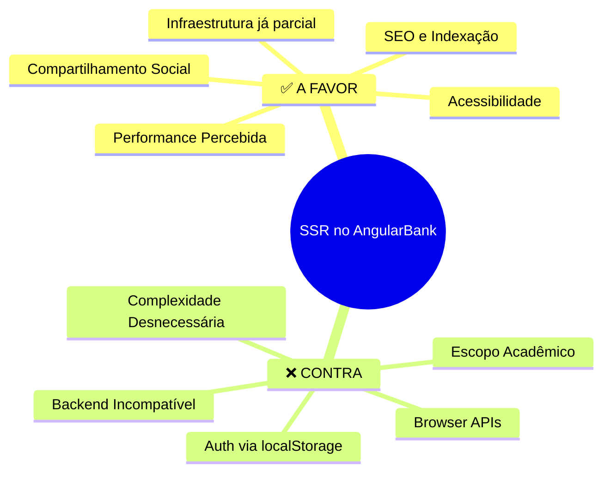
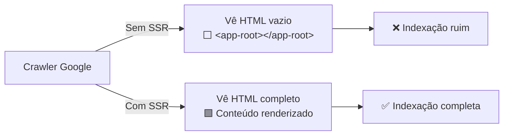
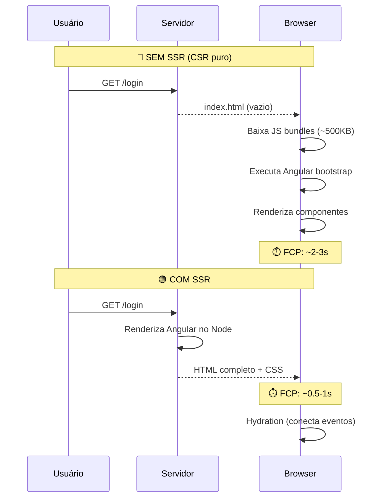
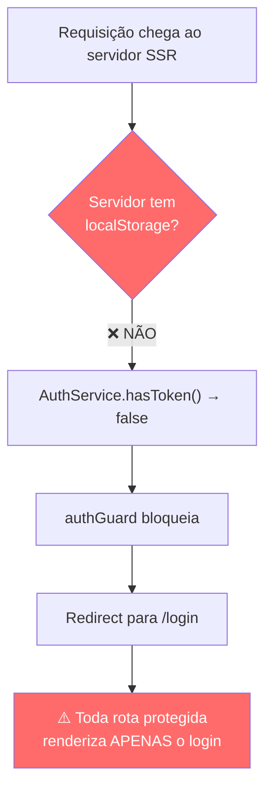
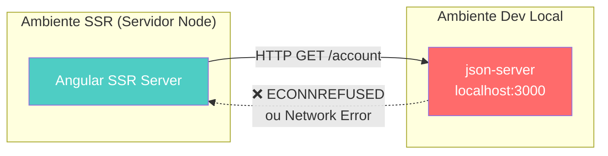
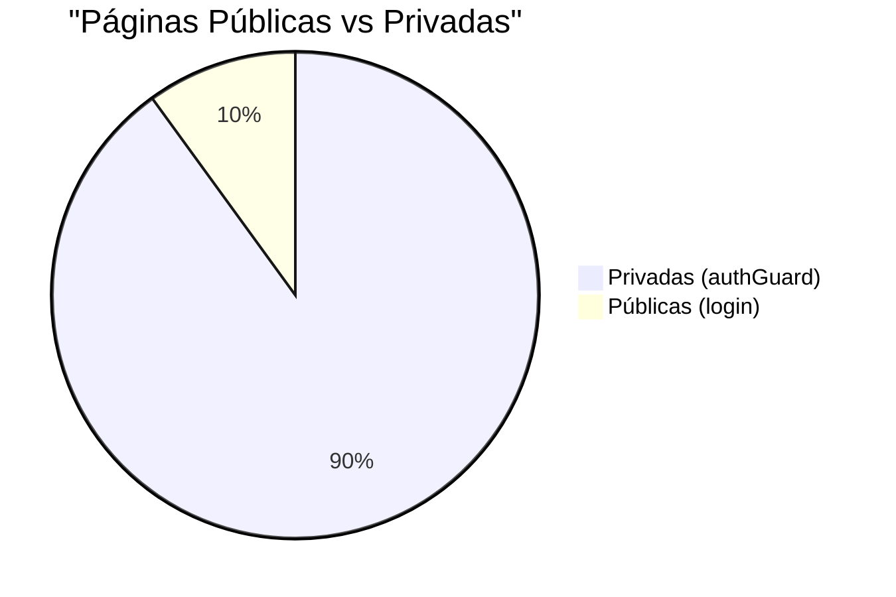
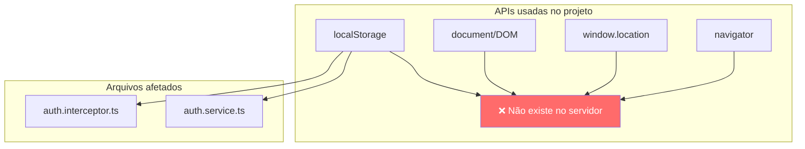
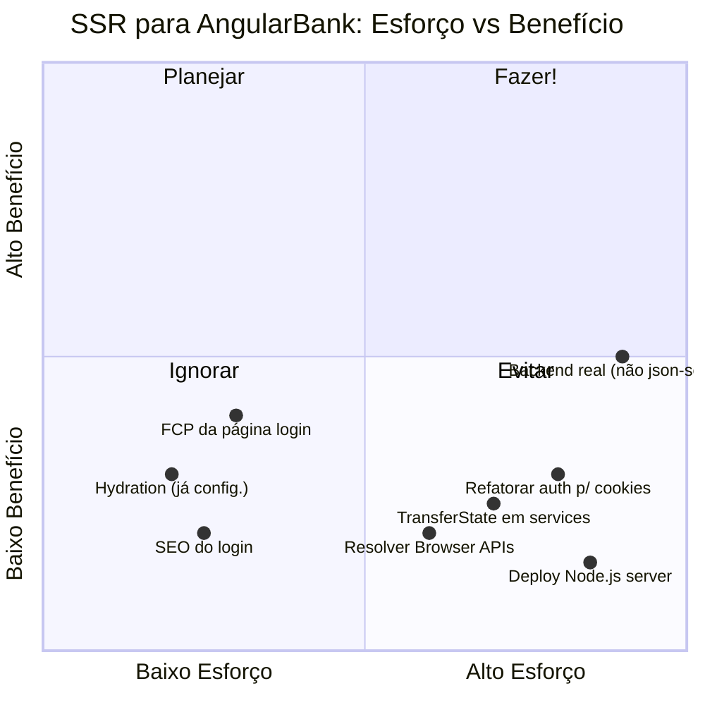
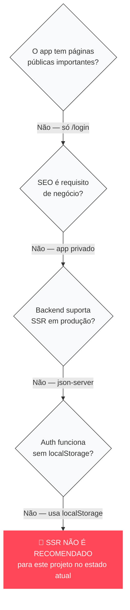

# 🏦 SSR no AngularBank — Análise de Prós e Contras

> Análise contextualizada para o projeto **AngularBank** (Angular 19 + json-server)

---

## 📊 Mapa Mental — Visão Geral



---

## ✅ Motivos PARA usar SSR

### 1. 🔍 SEO e Indexação



| Aspecto | Sem SSR | Com SSR |
|---------|---------|---------|
| Conteúdo visível ao crawler | ❌ Apenas `<app-root>` | ✅ HTML completo |
| Meta tags dinâmicas | ❌ Estáticas no index.html | ✅ Geradas por rota |
| Open Graph (WhatsApp/LinkedIn) | ❌ Preview genérico | ✅ Preview personalizado |

**Relevância para o projeto**: ⚠️ **Baixa** — a página de login seria a única indexável; todo o restante é protegido.

---

### 2. ⚡ Performance Percebida (Core Web Vitals)



| Métrica | Sem SSR | Com SSR | Ganho |
|---------|---------|---------|-------|
| **FCP** (First Contentful Paint) | ~2-3s | ~0.5-1s | 🟢 60-70% |
| **LCP** (Largest Contentful Paint) | ~3-4s | ~1-2s | 🟢 50% |
| **TTI** (Time to Interactive) | ~3s | ~3s | 🟡 Similar |
| **CLS** (Cumulative Layout Shift) | Maior | Menor | 🟢 Melhor |

**Relevância para o projeto**: ⚠️ **Média** — benefício real apenas na tela de login (única rota sem guard).

---

### 3. 📱 Compartilhamento Social

Quando alguém compartilha o link do banco no WhatsApp ou LinkedIn, o SSR permite gerar previews corretos com título, descrição e imagem.

**Relevância para o projeto**: ❌ **Nula** — app bancário privado não é compartilhado socialmente.

---

### 4. 🏗️ Infraestrutura Já Parcialmente Configurada

O projeto **já possui** elementos de SSR instalados:

```
✅ @angular/ssr@19.2.22          → Pacote instalado
✅ provideClientHydration()       → Configurado no app.config.ts
✅ withEventReplay()              → Habilitado
✅ angular.json → server entry    → src/main.server.ts
✅ angular.json → ssr.entry       → src/server.ts
✅ package.json → serve:ssr       → Script pronto
✅ isPlatformBrowser() checks     → Auth service e interceptor
```

**Relevância para o projeto**: 🟢 **Alta** — parte do trabalho já está feita.

---

### 5. ♿ Acessibilidade

SSR envia HTML semântico completo, beneficiando:
- Screen readers (conteúdo disponível sem JS)
- Navegadores com JS desabilitado
- Conexões lentas (conteúdo antes do JS)

**Relevância para o projeto**: ⚠️ **Baixa** — o app depende de JS para funcionar (formulários, Material, etc).

---

## ❌ Motivos para NÃO usar SSR

### 1. 🔐 Autenticação Baseada em localStorage (BLOQUEADOR CRÍTICO)



**O problema central:**

```typescript
// auth.service.ts — localStorage não existe no servidor!
private hasToken(): boolean {
    return this.isBrowser && !!localStorage.getItem('token');
}
```

| Rota | Protegida? | SSR renderiza |
|------|-----------|---------------|
| `/login` | ❌ | ✅ Login page |
| `/dashboard` | ✅ authGuard | ❌ Redirect → login |
| `/transferencia` | ✅ authGuard | ❌ Redirect → login |
| `/transacoes` | ✅ authGuard | ❌ Redirect → login |
| `/emprestimo` | ✅ authGuard | ❌ Redirect → login |
| `/perfil/**` | ✅ authGuard | ❌ Redirect → login |

> **Resultado**: SSR só consegue renderizar `/login`. Todas as outras 8+ rotas sempre redirecionam, tornando SSR inútil para 90% da aplicação.

---

### 2. 🖥️ Backend Incompatível com SSR



**Problemas encontrados nos serviços:**

```typescript
// dashboard.service.ts
apiUrl = 'http://localhost:3000';  // ❌ Hardcoded!

// transactions.service.ts  
private apiUrl = 'http://localhost:3000/transactions';  // ❌ Hardcoded!
```

- json-server é um mock local — não funciona em produção
- URLs hardcoded não resolvem do lado do servidor em deploy
- Nenhuma estratégia de `TransferState` para evitar requests duplicados

---

### 3. 🎯 Complexidade Desproporcional ao Benefício



| Fator | Impacto |
|-------|---------|
| Única página pública | `/login` (formulário simples) |
| Servidor Node.js adicional | 💰 Custo de infraestrutura |
| Complexidade de deploy | 🔧 Muito maior que SPA estático |
| Debugging mais difícil | 🐛 Server + Client errors |
| `TransferState` necessário | 🔄 Evitar fetch duplicado |
| Platform checks em todo lugar | 📝 `isPlatformBrowser()` sempre |

---

### 4. 🌐 Problemas com Browser APIs



**Mitigações já presentes (parciais)**:
```typescript
// auth.service.ts — ✅ Tem check de plataforma
private isBrowser = isPlatformBrowser(this.platformId);

// auth.interceptor.ts — ✅ Tem check de plataforma
const token = isPlatformBrowser(platformId) ? localStorage.getItem('token') : null;
```

Mas: precisa verificar **todos** os componentes que usam APIs de browser (Angular Material dialogs, scroll, etc).

---

### 5. 📚 Escopo Acadêmico do Projeto

| Característica | Detalhe |
|---------------|---------|
| Contexto | Módulo 2 — Ada Tech |
| Backend | json-server (mock) |
| Autenticação | Credenciais hardcoded |
| Deploy | Não previsto para produção |
| Público-alvo | Avaliação acadêmica |

---

## 📋 Quadro Comparativo Final



---

## 🎯 Veredicto



### Resumo executivo

| | Peso | Veredito |
|---|---|---|
| **A favor** | SEO, FCP, infra parcial | Benefícios marginais — só `/login` se beneficia |
| **Contra** | Auth, backend, escopo | Bloqueadores críticos em 90% das rotas |
| **Recomendação** | | **❌ Não usar SSR neste projeto** |

### Se no futuro quiser SSR, precisaria:
1. **Migrar auth para cookies HTTP-only** (acessíveis pelo servidor)
2. **Substituir json-server** por um backend real (Express/NestJS)
3. **Implementar TransferState** para evitar requests duplicados
4. **Adicionar páginas públicas** que justifiquem o SSR (landing page, sobre, etc.)
5. **Configurar `server.ts`** com proxy correto para a API

---

*Documento gerado em 28/03/2026 — Análise baseada no código-fonte do projeto AngularBank*
